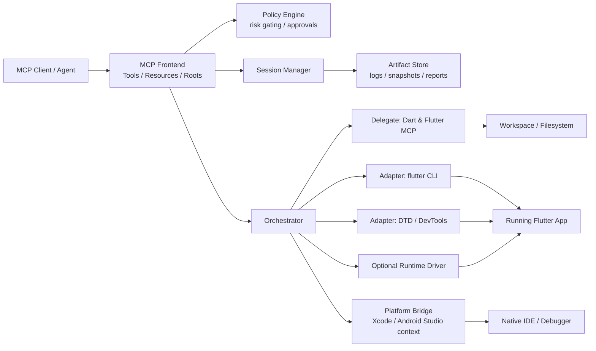
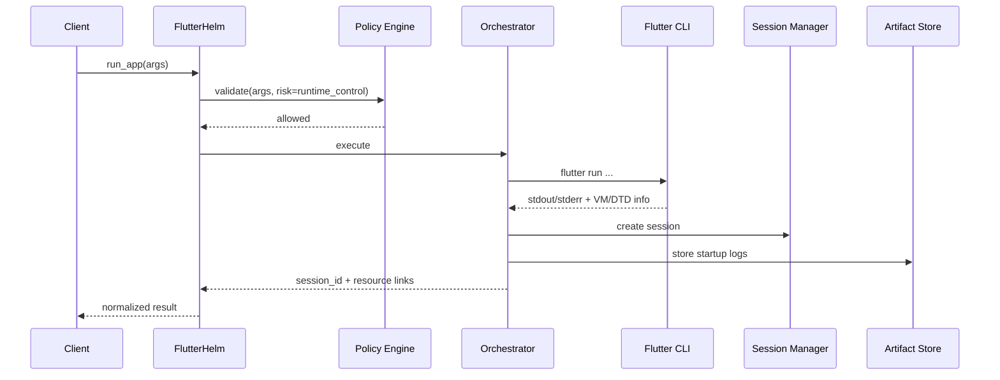
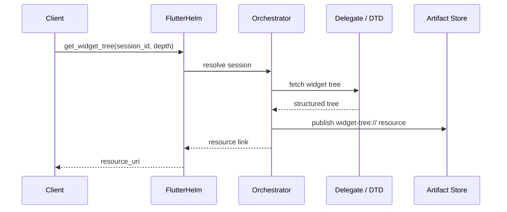
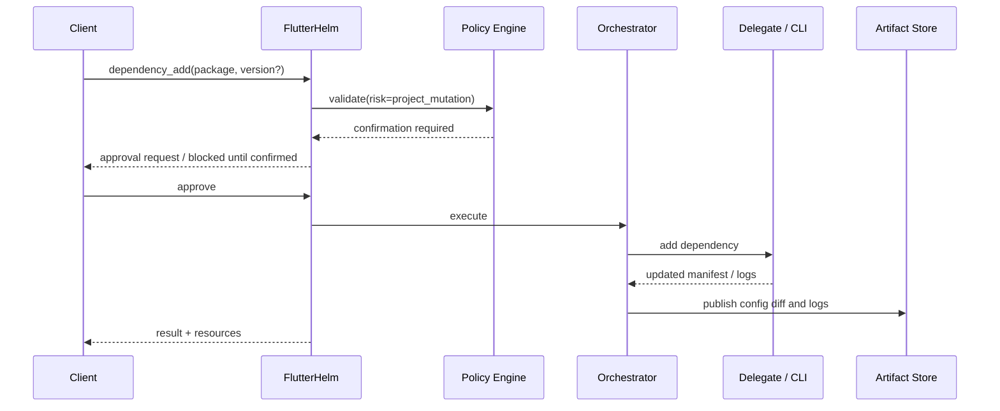

# アーキテクチャ

## 1. 目標アーキテクチャの要点

FlutterHelm は単一の巨大実装ではなく、**MCP front-end + orchestrator + adapters** の構造を採ります。

これにより、

- official surface の進化に追随しやすい
- 危険操作を central policy で制御できる
- 重い artifact を統一形式で出せる
- UI automation のような不安定機能を optional にできる

という利点が得られます。

## 2. コンポーネント図

## 3. 各層の責務

### 3.1 MCP Frontend

責務:

- Tools / Resources の expose
- client capabilities negotiation
- roots 受領
- schema validation
- version negotiation
- audit metadata の付与

設計方針:

- 初期 transport は **stdio**
- HTTP は後段
- tool response は短く、重い出力は resource link 中心

### 3.2 Policy Engine

責務:

- action risk classification
- confirmation gate
- root boundary enforcement
- process ownership enforcement
- secret redaction policy

重要な理由:

ツール群が増えるほど、危険操作を個別実装へ散らすと一貫性が崩れるため。

### 3.3 Session Manager

責務:

- session create / update / close
- runtime attachment metadata 管理
- lifecycle state 管理
- session ownership / locking
- artifact index 管理

Session が一級オブジェクトでないと、Flutter 開発における反復ループを AI が安定して辿れません。

### 3.4 Orchestrator

責務:

- tool call を実行計画へ変換
- 適切な adapter / delegate を選択
- fallback 戦略の実施
- result normalization
- resource publishing

FlutterHelm の本質はここです。  
たとえば `run_app` は単なる `flutter run` 実行ではなく、

- workspace 確認
- device 解決
- mode / flavor 検証
- log capture
- VM service / DTD URI 解析
- session 登録
- startup artifact 発行

まで含みます。

### 3.5 Adapters / Delegates

#### A. Dart & Flutter MCP delegate

使いどころ:

- analyze
- symbol resolution
- runtime errors
- widget tree
- package search
- dependency mutation
- tests の一部

方針:

- できる限り official implementation を再利用する
- FlutterHelm は contract 安定化と orchestration に集中する

#### B. Flutter CLI adapter

使いどころ:

- device list
- run
- attach
- stop
- build
- test fallback
- coverage export

方針:

- 実行面の正規口は CLI とみなす

#### C. DTD / DevTools adapter

使いどころ:

- timeline
- CPU profile
- memory snapshot
- performance overlay
- DevTools-aware resource extraction

#### D. Optional runtime driver

使いどころ:

- tap
- enter text
- scroll
- screenshot
- semantic locator based interaction

方針:

- core から分離し、opt-in にする
- 失敗前提で設計する

#### E. Platform bridge

使いどころ:

- iOS debug context
- Android debug context
- native handoff package

方針:

- native debugger を置き換えない
- 人間が IDE に持ち込める文脈束を作る

## 4. 代表的なシーケンス

## 4.1 `run_app`

### 正規化結果例

- `session_id`
- `state`
- `vm_service_uri` (masked as needed)
- `dtd_uri` (masked as needed)
- `resources`
  - `log://...`
  - `session://...`

## 4.2 `get_widget_tree`

## 4.3 `dependency_add`

## 5. 配置モデル

### Mode A: Local desktop companion

- 一番現実的
- Flutter SDK, Dart SDK, IDE, simulators/emulators が同一マシン上
- stdio transport に最適

### Mode B: Devcontainer / remote workspace

- 可能だが root / device / GUI debug まわりが複雑化
- 初期 target には入れるが最優先ではない

### Mode C: CI runner

- read-only diagnostics や test orchestration には使える
- runtime interaction と native bridge は制約が大きい

## 6. State management

Session state は最低限以下を持ちます。

- `created`
- `starting`
- `running`
- `attached`
- `stopped`
- `failed`
- `disposed`

補助状態:

- `profile_active`
- `driver_connected`
- `native_bridge_ready`

## 7. Failure handling 方針

### 7.1 Delegate unavailable

- official delegate 不可 → CLI / fallback diagnostics へ切り替え
- ただし capability downgrade を明示して返す

### 7.2 Session stale

- process death / DTD disconnect を検知したら `stale` フラグを付与
- read-only artifact は残す
- mutation 系操作は拒否する

### 7.3 Roots mismatch

- active root 外の path を受けたら拒否
- fallback mode 有効時のみ、明示 root set を要求

## 8. なぜこの形がよいか

この構造は、Flutter の実務で必要な「観測」「操作」「橋渡し」を分けて扱えるからです。

- `flutter` CLI は **実行**
- official MCP server は **code intelligence / project-aware actions**
- DevTools / DTD は **runtime observation**
- native IDE は **platform deep debugging**

FlutterHelm はそれらの**境界を保ったまま、人間と AI の両方にとって扱いやすい contract を作る**ための層として機能します。
