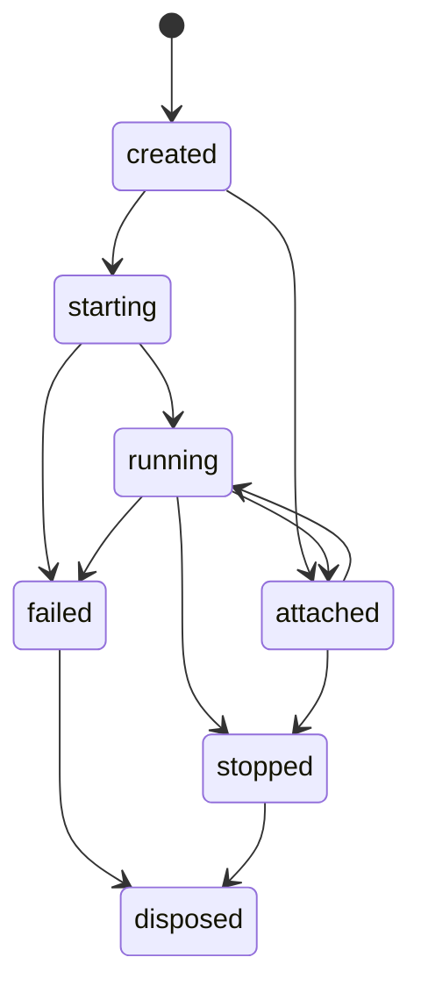

# Session / Resource モデル

## 1. なぜ Session を一級オブジェクトにするのか

Flutter 開発における AI の価値は、単発コマンドではなく反復にあります。

```text
run
→ observe
→ change
→ reload
→ observe again
→ compare
```

この流れを支えるため、FlutterHelm は **session-first** を採ります。  
単発の `flutter run` 実行結果ではなく、「その後も観測・比較・停止の対象になる運転中の文脈」を session として扱います。

## 2. Session の定義

Session は、**1 つの workspace / target / platform / device / mode / runtime attachment の束**です。

### Session object

```json
{
  "sessionId": "sess_01H...",
  "workspaceRoot": "/work/app",
  "ownership": "owned",
  "platform": "ios",
  "deviceId": "00008110-...",
  "target": "lib/main.dart",
  "flavor": "staging",
  "mode": "debug",
  "state": "running",
  "stale": false,
  "pid": 18342,
  "appId": "sample_app",
  "vmService": {
    "available": true,
    "maskedUri": "ws://127.0.0.1:.../ws"
  },
  "dtd": {
    "available": false
  },
  "profileActive": false,
  "adapters": {
    "delegate": "dart_flutter_mcp",
    "launcher": "flutter_cli",
    "profiling": "vm_service",
    "runtimeDriver": null
  },
  "createdAt": "2026-04-11T12:34:56Z",
  "lastSeenAt": "2026-04-11T12:35:12Z",
  "lastExitAt": null,
  "lastExitCode": null
}
```

## 3. Session state machine



### 補助フラグ

- `profileActive`
- `driverConnected`
- `hasPendingApproval`
- `stale`
- `nativeBridgeReady`

## 4. Session の生成経路

### 4.1 `session_open`

まだ app を起動しない文脈 session。  
root / target / flavor / mode を固定し、後段の `run_app` 等で再利用する。

### 4.2 `run_app`

新規プロセス起動を伴う session。  
process metadata と artifact を伴う。

### 4.3 `attach_app`

既存プロセスへ紐づく session。  
必ずしも process ownership を持たない。

## 5. Session ownership

安全性のため、FlutterHelm は session を 3 種類に分けます。

### Context session

`session_open` が返す準備段階の session。  
まだ process ownership を持たず、`run_app` の対象として昇格できる。

### Owned session

FlutterHelm 自身が起動したプロセスに紐づく。  
`stop_app`, `hot_reload`, `hot_restart` などを比較的安全に扱える。

### Attached session

既存プロセスへ接続しただけ。  
この場合、停止や強い mutation は制限する。

### 5.1 Persistence と stale session

Phase 1 では session metadata を `stateDir/sessions.json` に永続化する。  
server 再起動後、live process handle を持たない session は `stale=true` として復元する。

- session summary と app state は resource として再読可能
- owned でも stale session に対する mutation は禁止
- live VM service がある session のみ `get_widget_tree` を許可
- profiling は owned + running + live VM service session のみ許可

## 6. Resources の位置づけ

MCP の Resources は、**tool result へ巨大 payload を押し込まないための設計上の逃がし先**です。  
FlutterHelm はこれを徹底します。

### Resource-first にすべき対象

- widget tree
- runtime errors の詳細
- stdout / stderr
- test reports
- coverage
- CPU profiles
- memory snapshots
- timeline captures
- screenshots
- native handoff bundle

## 7. Resource URI スキーム

## 7.1 session / config

- `session://<session-id>/summary`
- `session://<session-id>/health`
- `config://workspace/current`
- `config://workspace/defaults`

## 7.2 logs / diagnostics

- `log://<session-id>/stdout`
- `log://<session-id>/stderr`
- `runtime-errors://<session-id>/current`
- `widget-tree://<session-id>/current?depth=3`
- `app-state://<session-id>/summary`

## 7.3 test / coverage

- `test-report://<run-id>/summary`
- `test-report://<run-id>/details`
- `coverage://<run-id>/lcov`
- `coverage://<run-id>/summary`

## 7.4 profiling

- `timeline://<session-id>/<capture-id>`
- `memory://<session-id>/<snapshot-id>`
- `cpu://<session-id>/<capture-id>`

public profiling resource は summary JSON を返し、raw heap snapshot は session artifact 配下の sidecar として保持します。

## 7.5 assets / visuals

- `screenshot://<session-id>/<capture-id>.png`

## 7.6 native handoff

- `native-handoff://<session-id>/ios`
- `native-handoff://<session-id>/android`

native handoff resource は JSON manifest です。zip export ではなく、既存 resource と native project path を束ねます。

```json
{
  "sessionId": "sess_01H...",
  "platform": "ios",
  "status": "ready",
  "workspaceRoot": "/work/app",
  "summary": {
    "sessionState": "running",
    "ownership": "owned",
    "stale": false,
    "availablePlatforms": ["ios"],
    "openPathCount": 3,
    "evidenceCount": 6,
    "hypothesisCount": 2
  },
  "openPaths": [
    {
      "path": "/work/app/ios/Runner.xcworkspace",
      "label": "Xcode workspace",
      "reason": "Open this workspace in Xcode for native debugging and signing context."
    }
  ],
  "evidenceResources": [
    {
      "uri": "session://sess_01H/summary",
      "mimeType": "application/json",
      "title": "Session summary"
    },
    {
      "uri": "runtime-errors://sess_01H/current",
      "mimeType": "application/json",
      "title": "Runtime errors"
    }
  ],
  "fileHints": [
    {
      "path": "/work/app/ios/Runner/Info.plist",
      "label": "Info.plist",
      "reason": "Check permissions, bundle metadata, and local network related keys."
    }
  ],
  "hypotheses": [
    "VM service was unavailable for this iOS session; on iOS 14+ verify that the Local Network permission prompt was allowed and retry the attach/debug flow."
  ],
  "nextSteps": [
    "Open ios/Runner.xcworkspace in Xcode and reproduce with the attached Flutter logs beside you."
  ],
  "limitations": [
    "FlutterHelm is not a native debugger replacement; use Xcode for LLDB, signing, and device-level native inspection."
  ],
  "generatedAt": "2026-04-12T00:00:00Z"
}
```

`status` は次の 3 値です。

- `ready`: native project と handoff evidence が揃っている
- `partial`: native project はあるが evidence が限定的
- `unavailable`: 対応 native project が workspace に見つからない

## 8. Resource metadata

各 resource は最低限以下を持ちます。

```json
{
  "uri": "widget-tree://sess_01H/current?depth=3",
  "mimeType": "application/json",
  "title": "Widget tree snapshot",
  "description": "Captured from running iOS debug session",
  "sizeBytes": 48321,
  "createdAt": "2026-04-11T12:36:12Z",
  "sessionId": "sess_01H..."
}
```

## 9. Retention policy

初期設計として次を提案します。

### Metadata retention

- session metadata: 30 days
- audit log: 30 days

### Heavy artifacts retention

- stdout/stderr: 7 days
- widget trees / runtime errors: 7 days
- test reports / coverage: 14 days
- profiles / timelines / memory snapshots: 7 days
- screenshots: 7 days

### Capacity management

- workspace 単位で容量上限を持つ
- 上限超過時は LRU で削除
- pinned artifact は削除対象から外す

## 10. Resource access pattern

Tool は極力この形で返します。

```json
{
  "summary": {
    "errorCount": 2,
    "primaryError": "RenderFlex overflowed by 32 pixels"
  },
  "resource": {
    "uri": "runtime-errors://sess_01H/current",
    "mimeType": "application/json",
    "title": "Runtime errors"
  }
}
```

これにより、

- agent はまず summary で判断できる
- 必要なときだけ resource を読む
- 長大 payload の常時注入を避けられる

## 11. Roots と Session の関係

### Roots-aware mode

- client が roots を渡す
- session はその root に紐づく
- path validation は root 境界で行う

### Root fallback mode

- client が roots を扱えない / 壊れている場合に限る
- server 起動オプションで明示的に有効化
- `workspace_set_root` を要求
- absolute path + canonical path validation を強制

## 12. Multi-root 対応

複数 Flutter workspace を同一 client で扱うケースに備えます。

- active root は session ごとに 1 つ
- cross-root action は禁止
- compare 系は resource level でのみ許可
- dependency mutation は active root のみ

## 13. Session health

`session://<id>/health` では以下を返します。

```json
{
  "sessionId": "sess_01H...",
  "ready": true,
  "issues": [],
  "guidance": [
    "Profile mode is recommended for performance measurements.",
    "DTD is not available; FlutterHelm will use vm_service-backed profiling."
  ],
  "ownership": "owned",
  "stale": false,
  "state": "running",
  "currentMode": "debug",
  "recommendedMode": "profile",
  "vmServiceAvailable": true,
  "dtdAvailable": false,
  "backend": "vm_service",
  "profileActive": false
}
```

この resource は profiling failure の `detailsResource` としても使われます。  
attached / stale / release session では `issues` と `guidance` が増え、なぜ profiling が拒否されたかを short error とは別に読めます。

## 14. このモデルの効用

Session / Resource を中心に置くことで、FlutterHelm は「コマンド集」ではなくなります。  
代わりに、**再利用可能な開発文脈と診断資産を持つ runtime-aware system** になります。  
これが、Flutter の agentic workflow を成立させる土台です。
